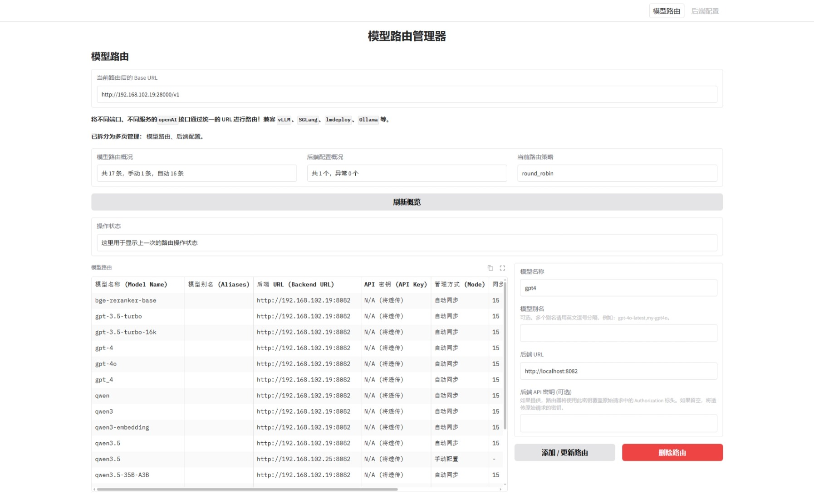
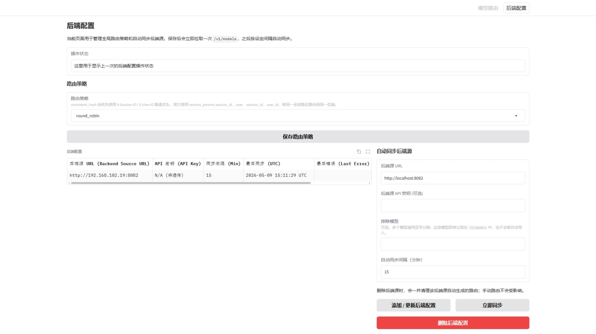

<!-- markdownlint-disable MD033 -->
<h1 align="center">
🚀 OpenAI Router
</h1>

<p align="center">
<b>轻量级、持久化、零配置的 OpenAI API 统一网关</b><br>
一键聚合 vLLM、SGLang、lmdeploy、Ollama…
</p>

<p align="center">
<a href="#"></a>
<a href="https://gradio.app"></a>
<a href="#"></a>
<a href="https://pypi.org/project/openai-router/"></a>
<a href="https://pypistats.org/packages/openai-router"></a>
</p>

---

- 将不同推理框架（vLLM、SGLang、lmdeploy、Ollama…）、不同 `Host`、不同 `Port` 的 OpenAI API 接口统一聚合到同一个 `base_url` 上，实现更便捷的模型调用。

## ✨ Features

| Feature | Description |
| --- | --- |
| 🌍 统一入口 | `/chat/completions`、`/embeddings`、`/images/generations`… 全部转发 |
| 🧩 多后端 | vLLM、SGLang、lmdeploy、Ollama… 任意组合 |
| 💾 持久化 | SQLite + SQLModel 零配置存储路由 |
| ⚡ 负载均衡 | 可配置多个同名模型，自动进行轮询式负载均衡 |
| 🎨 Web UI | Gradio 即用的管理面板 |
| 🔍 兼容 OpenAI | SDK / LangChain / AutoGen / LlamaIndex / CrewAI 等一行代码都不用改 |
| 📝 请求/响应日志 | 自动使用 Jinja2 模板渲染和打印聊天请求与响应内容，支持流式输出和思考过程 |

---

## 📝 请求/响应日志（重点功能 🚀）

> ⚠️ **其他开源路由（如 vLLM Router、SGLang Model Gateway、OneAPI 等）均不支持此功能！**
>
> 在大模型开发调试过程中，无法直接看到模型收到的"原始提示词"和"思考过程"，只能通过后端日志或额外工具来查看，非常不便。

Router 会自动记录聊天接口（`/v1/chat/completions`、`/v1/completions`、`/v1/responses`）的请求和响应内容：

### 请求日志
- 当请求包含 `messages` 字段时，使用 `chat_template.jinja` 模板渲染为完整的提示词字符串
- 渲染后的提示词会通过 `logger.info` 打印到日志
- **你能直接看到模型收到的原始提示词**，方便排查提示词工程问题

### 响应日志
- **非流式响应**：直接解析响应 JSON，提取 `content` 和 `reasoning`（思考过程）
- **流式响应**：收集所有 SSE chunks，等待流式传输完成后一次性打印完整内容
- 如果模型返回了 `reasoning` 或 `thinking` 字段，会一起打印（格式为 `<think>\n...\n</think>`）
- **你能直接看到模型的思考过程**，这对调试思维链模型至关重要

### 示例输出

**请求日志示例：**
```
INFO: Rendered prompt:
<|im_start|>system
你是一个有帮助的助手。<|im_end|>
<|im_start|>user
你好！<|im_end|>
<|im_start|>assistant
<think>

</think>

```

**响应日志示例：**
```
INFO: Model response:
<think>
1. 分析用户输入：用户用中文打招呼
2. 确定意图：只是想开始对话
3. 构思回复：用中文问候，并询问有什么可以帮助的
</think>

你好！很高兴能为你提供帮助。请问今天有什么我可以帮你的吗？😊
```

有了这个功能，你在调试 LLM 应用时再也不用猜测模型在想什么了！

---

## 快速开始

### 运行前准备

- Python `3.11+`
- 一个已经能正常工作的 OpenAI 兼容后端
- 后端地址建议先单独验证可用，例如：

```bash
curl http://127.0.0.1:8001/v1/models
```

### 方式一：在当前仓库内运行（推荐）

适合你现在这种直接使用本项目源码的方式。

```bash
uv sync
uv run openai-router --host 0.0.0.0 --port 28000
```

如果你不用 `uv`，也可以：

```bash
pip install -e .
openai-router --host 0.0.0.0 --port 28000
```

### 方式二：从 PyPI 安装

```bash
uv tool install openai-router
openai-router --host 0.0.0.0 --port 28000
```

或者：

```bash
pip install -U openai-router
openai-router --host 0.0.0.0 --port 28000
```

### `uv tool` 安装和使用示例

如果你不想进入项目源码目录，也不想自己管理虚拟环境，可以直接用 `uv tool`：

```bash
uv tool install openai-router
uv tool run openai-router --host 0.0.0.0 --port 28000
```

如果你刚安装完，命令还没有生效，可以先执行：

```bash
uv tool update-shell
```

然后重新打开终端，再检查：

```bash
openai-router --help
```

启动后，继续按本文后面的步骤：

- 打开 `http://127.0.0.1:28000/` 配置模型路由
- 使用 `http://127.0.0.1:28000/v1` 作为统一 `base_url`

### 启动后你应该看到什么

服务启动后可访问：

- Web UI：`http://127.0.0.1:28000/`
- Swagger：`http://127.0.0.1:28000/docs`
- 健康检查：`http://127.0.0.1:28000/health`
- OpenAI 兼容入口：`http://127.0.0.1:28000/v1`

先验证健康检查：

```bash
curl -i http://127.0.0.1:28000/health
```

返回 `HTTP/1.1 200 OK` 说明服务已启动。

---

## 教程一：手动添加一条模型路由

这是最直接、最不容易出错的用法，建议第一次先用这个方式跑通。

### 场景

假设你的后端服务地址是：

```text
http://127.0.0.1:8001/v1
```

并且这个后端支持模型 `gpt-4o`。

### 操作步骤

1. 打开 `http://127.0.0.1:28000/`
2. 在“模型路由”页填写：
   - 模型名称：`gpt-4o`
   - 模型别名：可留空，或填写 `gpt-4o-latest`
   - 后端 URL：`http://127.0.0.1:8001/v1`
   - 后端 API 密钥：按需填写
3. 点击“添加 / 更新路由”



### 每个字段怎么理解

- 模型名称：客户端请求时 `model` 字段使用的名字
- 模型别名：可选，多个别名用英文逗号分隔
- 后端 URL：填写后端“基地址”，不要填写具体接口路径
- 后端 API 密钥：
  - 填了：Router 会用这个密钥覆盖客户端传入的 `Authorization`
  - 不填：Router 会透传客户端原始 `Authorization`

### 后端 URL 的正确写法

正确示例：

- `http://127.0.0.1:8001`
- `http://127.0.0.1:8001/v1`

错误示例：

- `http://127.0.0.1:8001/v1/chat/completions`
- `http://127.0.0.1:8001/v1/models`

原因是 Router 会自动把请求路径拼接到你填写的后端 URL 后面。

---

## 教程二：自动同步一个后端源

如果你的后端支持模型列表接口，这个方式更省事。

### Router 的自动发现规则

当你添加“后端源”时，Router 会立即尝试获取模型列表：

- 如果你填的是 `http://127.0.0.1:8001`，会优先请求 `/v1/models`，再尝试 `/models`
- 如果你填的是 `http://127.0.0.1:8001/v1`，会请求 `/v1/models`

### 操作步骤

1. 打开 `http://127.0.0.1:28000/sources`
2. 填写：
   - 后端源 URL：`http://127.0.0.1:8001/v1`
   - 后端源 API 密钥：按需填写
   - 排除模型：可留空；多个模型用逗号分隔
   - 自动同步间隔：例如 `15`
3. 点击“添加 / 更新后端配置”

保存后会立即拉取一次模型列表，并自动生成对应路由。



### 什么时候用“排除模型”

如果后端暴露了很多模型，但你只想导入一部分，可以在这里填不想暴露出去的模型名。

### 一个重要行为

自动同步导入的路由属于“自动管理”：

- 你手工删掉某条自动路由后，后端下次同步时可能会再次创建回来
- 如果你不想它再出现，应当：
  - 在“排除模型”中排除它
  - 或直接删除该后端源

---

## 教程三：像 OpenAI 官方 SDK 一样调用

配置好路由后，业务代码只需要把 `base_url` 指向 Router。

### 先列出模型确认路由是否生效

```bash
curl http://127.0.0.1:28000/v1/models \
  -H "Authorization: Bearer sk-test"
```

你应该能看到刚才配置的模型名或别名。

### Python 示例

```python
from openai import OpenAI

client = OpenAI(
    base_url="http://127.0.0.1:28000/v1",
    api_key="sk-test",
)

resp = client.chat.completions.create(
    model="gpt-4o",
    messages=[{"role": "user", "content": "hello"}],
    stream=False,
)

print(resp.choices[0].message.content)
```

### cURL 示例

如果你没有在 Router 中给该后端配置专用 API Key，那么这里的 `Authorization` 需要是真实可用的后端密钥。

```bash
curl http://127.0.0.1:28000/v1/chat/completions \
  -H "Content-Type: application/json" \
  -H "Authorization: Bearer sk-test" \
  -d '{
    "model": "gpt-4o",
    "messages": [{"role": "user", "content": "你好"}]
  }'
```

### 流式输出示例

```python
from openai import OpenAI

client = OpenAI(
    base_url="http://127.0.0.1:28000/v1",
    api_key="sk-test",
)

stream = client.chat.completions.create(
    model="gpt-4o",
    messages=[{"role": "user", "content": "请介绍一下你自己"}],
    stream=True,
)

for chunk in stream:
    text = chunk.choices[0].delta.content or ""
    print(text, end="")
```

---

## 多后端负载均衡怎么用

如果你给同一个模型名配置了多个后端，例如：

- `gpt-4o -> http://127.0.0.1:8001/v1`
- `gpt-4o -> http://127.0.0.1:8002/v1`

那么 Router 会把同一个 `model` 的请求分发到这些后端。

当前支持两种策略：

- `round_robin`：默认策略，轮询分发
- `consistent_hash`：同一会话尽量稳定落到同一后端

在 `http://127.0.0.1:28000/sources` 页面可以切换策略。

`consistent_hash` 会优先参考这些请求头：

- `X-Session-ID`
- `X-User-ID`
- `X-Tenant-ID`
- `X-Correlation-ID`
- `X-Request-ID`
- `X-Trace-ID`

如果没有这些请求头，会再尝试请求体里的 `session_params.session_id`、`user`、`session_id`、`user_id`。

---

## 支持的主要接口

除了 `/v1/models` 之外，Router 还会转发这些常见 OpenAI 风格接口：

- `POST /v1/responses`
- `POST /v1/completions`
- `POST /v1/chat/completions`
- `POST /v1/embeddings`
- `POST /v1/moderations`
- `POST /v1/images/generations`
- `POST /v1/images/edits`
- `POST /v1/images/variations`
- `POST /v1/audio/transcriptions`
- `POST /v1/audio/speech`
- `POST /v1/rerank`
- `POST /tokenize`
- `POST /detokenize`

---

## Docker 用法

仓库已经提供了可直接使用的 `Dockerfile` 和 `docker-compose.yml`。

### 启动

```bash
docker compose up --build -d
```

### 访问地址

- Web UI：`http://127.0.0.1:8000/`
- OpenAI 兼容入口：`http://127.0.0.1:8000/v1`

### 停止

```bash
docker compose down
```

容器内数据目录挂载为：

```text
./data -> /app/data
```

---

## 数据持久化

使用 SQLite 持久化保存路由配置。

源码方式运行时，数据库默认在：

```text
./data/routes.db
```

因此你重启服务后，路由配置仍然会保留。

---

## 常见问题

### 1. 为什么 `/v1/models` 没有我刚配置的模型？

按这个顺序排查：

1. 先看 UI 表格里是否真的保存成功
2. 检查模型名是否填错
3. 检查后端 URL 是否写成了具体接口路径
4. 如果是自动同步方式，确认后端的 `/v1/models` 能正常返回
5. 直接访问 `http://127.0.0.1:28000/v1/models` 看返回结果

### 2. 客户端的 API Key 应该填什么？

- 如果你在 Router 里为后端配置了 API Key：客户端可以填任意非空值，例如 `sk-test`
- 如果你没有在 Router 里配置后端 API Key：客户端必须传真实后端可用的 Bearer Token

### 3. 为什么我删除了一条自动同步的模型路由，它又出现了？

因为该模型还存在于后端的模型列表中，下次自动同步会重新导入。

正确做法是：

- 在“排除模型”中排除它
- 或删除对应后端源

### 4. 后端 URL 到底填不填 `/v1`？

两种都可以：

- `http://127.0.0.1:8001`
- `http://127.0.0.1:8001/v1`

但不要填写到具体接口层级，例如 `/v1/chat/completions`。

### 5. Router 自己支持鉴权吗？

当前项目主要做路由和转发，不提供单独的 Router 管理鉴权体系。它对请求头中的 `Authorization` 的处理逻辑是：

- 有后端专用 API Key：覆盖转发
- 没有后端专用 API Key：原样透传

---

## 架构图


